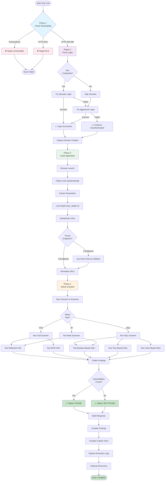

## Workflow Description

### Phase 1: Reachability Check ✅
- **Input**: Target URL
- **Process**: 
  - Send HTTP HEAD/GET request
  - Check response status code
  - Handle timeouts and connection errors
- **Output**: Reachable (bool), Status Message
- **Outcome if Failed**: Abort scan

### Phase 2: Authentication ✅
- **Input**: Target URL, Credentials (optional)
- **Process**:
  1. Launch headless browser
  2. Navigate to target
  3. If credentials provided: Try heuristic login
  4. If login fails: Try aggressive login methods
  5. Capture session cookies and auth tokens
- **Output**: Authentication success (bool), Session state
- **Note**: Continues even if authentication fails (unauthenticated scan)

### Phase 3: Crawling/Discovery ✅
- **Input**: Target URL, Authenticated session (optional)
- **Process**:
  1. Queue management with asyncio
  2. Browser automation with Playwright
  3. Link extraction from HTML
  4. Parameter extraction (GET/POST)
  5. URL deduplication
  6. Depth limiting to prevent infinite loops
- **Output**: List of discovered endpoints with methods and parameters
- **Fallback**: If no endpoints found, use entry point

### Phase 4: Attack/Exploitation ✅
- **Input**: List of endpoints, Attack type (XSS/SQLi/All)
- **Process**:
  1. **XSS Scanner**:
     - Test Reflected XSS on GET/POST parameters
     - Test DOM XSS on non-API endpoints
     - Multiple payload contexts (HTML, JS, Attribute)
     - Verify findings to reduce false positives
  
  2. **SQLi Scanner**:
     - Test Boolean-based SQLi
     - Test Time-based SQLi (SLEEP)
     - Test Union-based SQLi
     - Error-based detection
     - Support for different databases (MySQL, MSSQL, PostgreSQL)

- **Output**: List of vulnerabilities with:
  - Type (XSS or SQLi)
  - Severity
  - Target URL
  - Vulnerable parameter
  - Payload used
  - Evidence

### Output & Reporting
- **Status**: "found", "not found", or "failed"
- **Findings**: Detailed vulnerability list
- **Target Count**: Number of endpoints tested
- **Crawler URLs**: List of discovered endpoints
- **Execution Logs**: Complete log messages
